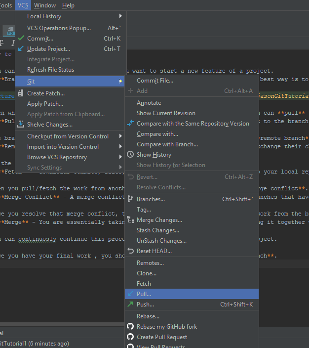

# Timeline

- **1937**: Alan Turing develops a theoretical computer
- **1957**: Russia puts Sputnik into orbit
- **1958**: President Eisenhower creates APRANET
- **1958**: NASA opens for business via Eisenhower executive order
- **1961**: Ecma was created to standardize European computer systems
- **1961**: Leonard Kleinrock of MIT – First paper on packet switching theory.
- **1962**: J.C.R. Licklider of MIT – memos on “Galactic Network Concept”
- **1967**: ARPANET, the basis of Internet, is developed
- **1969**: The first use of Internet: ARPANET connects four major U.S. universities for research and education
- **1969**: Larry Roberts – heads project that connects first two ARPANET sites – UCLA and Stanford 
- **1972**: Bob Kahn – demonstrates ARPANET at the International Computer Communication
- **1972**: Ray Tomlinson – First basic email program using “@”
- **1974**: Vinton Cerf & Ray Kahn - A Protocol for Packet Network Interconnection
- **1978**: TCP and IP split
- **1980**: Tim Berners-Lee – writes predecessor to WWW
- **1983**: Ethernet was introduced and standardized.
- **1983**: Jon Postel, Paul Mockapedis, and Craig Partridge design the Domain Name System (DNS)
- **1988**: The virus Internet Worm shuts down 10% of servers
- **1972**: Network email is introduced, and the symbol @ is used to separate the sender and the network
- **1982**: The word Internet is used
- **1990**: Tim Berners-Lee creates World Wide Web
- **1993**: Marc Andreesen – Develops Mosaic web browser
- **1994**: W3C, the main organization for WWW, is founded
- **1994**: Web browser Netscape was released.
- **1996**: Microsoft vs Netscape - Browser wars
- **1998**: ICANN, an organization that coordinates and maintains databases
- **1998**: Google search engine is created.

# BoilerPlate
 
  * ## Boilerplate src folder ##
    * **doc** - contains documentations
    * **img** - contains gitignore
    * **js** - contains javaScript files
    * **.editorconfig** - to define and maintain consistent coding styles
    * **.gitattributes** - gives attributes to pathnames
    * **.gitignore** - files or folders listed in this file will not be tracked by git
    * **404 html** - error html page when a page is not found
    * **browserconfig.xml** - used to define things like tile backgrounds, badge updates, and tile notifications. lets you set these images using external XML files rather than metadata within the HTML markup of the page.
    * **favicon.ico** - file containing one or more small icons, associated with a particular website or webpage such as the bookmark icon
    * **humans.txt** - a tribute to the people that contributed to the building of a website
    * **icon.png** - picture of the icon
    * **index.html** - the main webpage of a website that holds the html code of the page
    * **robots.txt** - used to instruct search engine robots to crawl & index pages on the website
    * **site.webmanifest** - provides information about your application in JSON format and about how it should behave.
    * **tile-wide.png** - can be used for the wide tile (558x270px)
    * **tile.png** - can be used for the small, medium, and large tiles being automatically resized if necessary(558x558px).
    
    
    
    
    
  * ## Boilerplate index.html ##
    * **<!doctype html>** - HTML5 doctype declaration 
    * **html class="no-js" lang=""** - html is the beginning of the html document, class is a created attribute to group items by class name. The "no-js" class can be used to specify custom styles when javascript is disabled. lang is the language that you're writing the code in.
    * **head** - head element is a container for metadata. All information about the webpage.
    * **meta charset="utf-8"** - utf-8 is one of the encoding methods created to be able to display and work with characters/words from other languages such as Mandarin, Arabic.
    * **meta http-equiv="x-ua-compatible" content="ie=edge"** - allows web authors to choose what version of Internet Explorer the page should be rendered as.
    * **title** - The title of your webpage that goes onto the tab open on your page.
    * **meta name="description" content=""** - gives a description of your webpage when it is used on search-engines.
    * **meta name="viewport" content="width-device-width, initial-scale=1"** -  A messaage to the mobile browser saying it's designed for mobile screens too. For a responsive web page
    * **link rel="manifest" href="site.webmanifest"** - deployment of the web app manifest
    * **link rel="apple-touch-icon" href="icon.png"** - defines an image to be used on Apple devices that represents that page or site.
    * **link rel="stylesheet" href="css/normalize.css"** - link to the normalize.css that provides better cross-browser consistency in the default styling of HTML elements.
    * **link rel="stylesheet" href="css/main.css"** - link to where you would put your main css file.
    * **body** - the body tag defines the document's body and contains all the actual contents of the document.
    * **if lte IE 9...upgrade your browser** - informing your site visitor that their choice of browser is outdated.
    * **the p tag** - signifies a paragraph.
    * **script src="js/vendor/modernizr-{{MODERNIZR_VERSION}}.min.js"** - the script tag is the beginning of the javascript code, and the src is the file where the javascript is located. Modernizr is a JS library that detects which HTML5 and CSS3 features your visitor's browser supports.
    * **all the jquery lines** - the version of jquery, and loading jquery from a CDN. The second script tag will check if window.jQuery is defined which means the script was successfully loaded from the CDN.
    * **script src="js/plugins.js"** - javascript plugins
    * **script src="js/main.js"** - location of your main javascript file
    * **window.ga** - adds analytics.js to your site. Activates google analytics tracking by inserting ga.js into the page.
    
# How to use git tutorial

# Git Tutorial

- **Git** is a version control system that tracks changes in website development.
- **GitHub** is a service that uses Git that is mostly used for coding.
- A **Repository** is a project on GitHub where data is stored and managed.
- When a repository is created, it can be accessed on WebStorm by **cloning** its URL.
- When changes are done in WebStorm, the user **commits** the changes, adding a comment for task, feature, or fix.
- After committing, the user **pushes** the branch to GitHub, where other contributors can access it by pulling.

* You can create a **branch** whenever you want to start a new feature of a project.
  * **Branch** - A branch is essentially different versions of the project. The best way is to make each branch a feature or a task. You are branching out from the original code base.
  

* Then when you're ready to combine the work you did with the work of others you can **pull** the other person's work into your branch.
  * **Pull** -  you are grabbing the code from a certain branch and inserting it to the branch you are currently on.
  

 

* The branch that you pull from can either be from your own local branch or a **remote branch**.
  * **Remote** - A remote is a common repository that all team members use to exchange their changes. It is usually stored on a code hosting service such as GitHub. Different than a local branch because a only the local user can see the local branches. 

* If the branch is remote you can use **fetch** instead of pull and then later merge.
  * **Fetch** - downloads commits, files, and refs from a remote repository into your local repository. It basically brings my local copy of the remote repository up to date.

* When you pull the work from another branch you will in turn have a **merge conflict**.
  * **Merge Conflict** - A merge conflict is when you're trying to merge two branches that have competing commits and git needs you to decide the final changes to the merge.

* Once you resolve that merge conflict, then you will officially **merge** the work from the branch that you pulled into your current branch.
  * **Merge** - You are essentially taking the contents of one branch and putting it together with the contents of another branch.

* You can continuosly continue this process until you are complete with your project.

* Once you have your final work , you should merge it all into the **master branch**.

